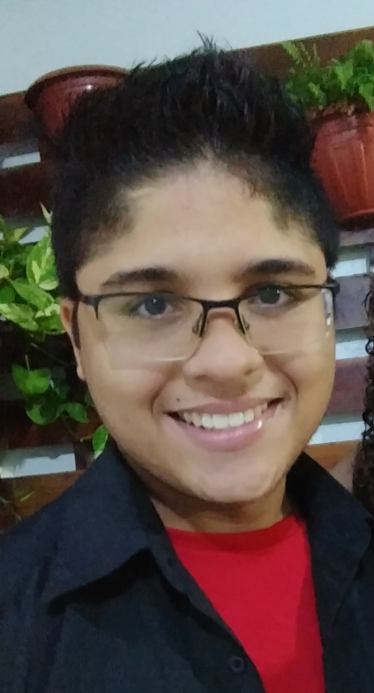

<h1 align="left">Olá amigos , Eu sou Paulo Renan</h1>

- 🔥 Bacharel em Administração pela Universidade Federal do Ceará, com foco em Tecnologia da Informação.

- 🔭 Trabalhei por dois anos com controle de qualidade e análise de dados no IBGE entre 2017 e 2023 durante os censos agropecuário e demográfico.

- 👨‍💻 Atualmente sou graduando em análise e desenvolvimento de sistemas com grande interessei por programar e desenvolver.

- ⚡ Conte comigo na sua jornada!

  

## 🛠 &nbsp;Tech Stack

&nbsp;
&nbsp;
&nbsp;
&nbsp;
&nbsp;
&nbsp;
&nbsp;

  

<h1 align="left" font-style="bold">Conheça meus projetos:</h1>

- Para conhecer o projeto cordel <a href="https://paulorenanta.github.io/portfolio/projeto-cordel/index.html" target="_blank">clique aqui</a>
- Veja também o projeto android <a href="https://paulorenanta.github.io/portfolio/projeto-android/index.html" target="_blank">clicando aqui</a>

  

<h1 align="left" font-style="bold">Reach-me</h1>

- 📫 Me envie um e-mail 

paulorenaan@gmail.com

- 💬 Acesse o meu LinkedIn

